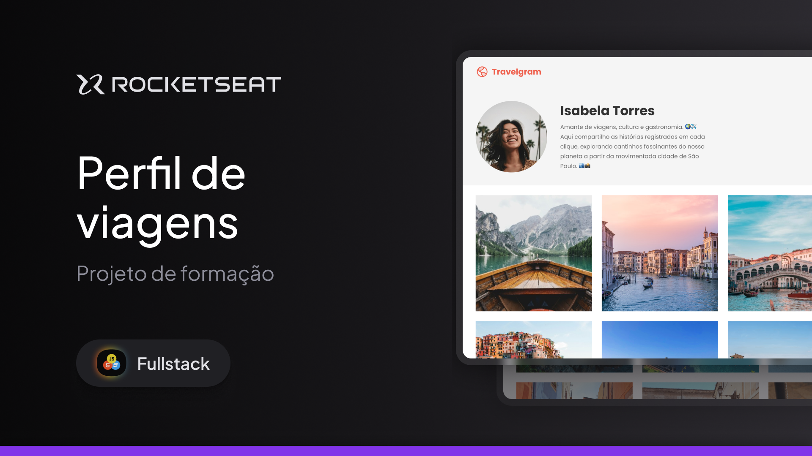

# Travelgram
<h1 align="center"> Travelgram - Travel Profile </h1>

Exclusive and free program, promoted by Rocketseat for teaching WEB technologies..  
<a href="https://www.rocketseat.com.br/" target="_blank">Study this project in video format by clicking here.</a>

  <a href="#-Technology">Technology</a>&nbsp;&nbsp;&nbsp;|&nbsp;&nbsp;&nbsp;
  <a href="#-Concepts">Concepts</a>&nbsp;&nbsp;&nbsp;|&nbsp;&nbsp;&nbsp;
  <a href="#-project">Project</a>&nbsp;&nbsp;&nbsp;|&nbsp;&nbsp;&nbsp;
  <a href="#-layout">Layout</a>&nbsp;&nbsp;&nbsp;|&nbsp;&nbsp;&nbsp;
  <a href="#-License">License</a>

  

 

  

## 🚀 Technology

This project wad developed with the following technologies:

- HTML e CSS
- Git e Github
- Figma

## 👨‍💻 Concepts

- Using the display and its attributes:

## 💻 Project

- The travelgram is a landing page designed solely to develop various display concepts and their behaviors

## 🔖 Layout

You can view the project layout through [THIS LINK](https://www.figma.com/community/file/1360315496868719817). You must use [Figma](https://figma.com) for acess.

## 📱 License

This project is under MIT license.

---

Made with ♥ by Rocketseat 👋 [Join our community!](https://discord.gg/rocketseat)